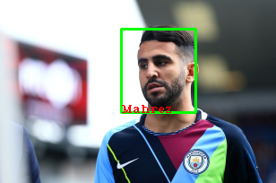

# Face_Recognize
## Cấu trúc folder
- align: thư mục dùng để chuẩn bị dữ liệu\\
	- |--- train_img:	thư mục dùng để chứa ảnh người mình muốn nhận dạng\\
	- |--- pre_img:		thư mục sau khi dùng mtcnn để để căn chỉnh và cắt mặt\\
	- |--- det1.npy, det2.npy, det3.npy: các file chứa trọng số của mtcnn\\
	- |--- detect_face:	file chính của mtcnn (cấu trúc mạng, xử lý)\\
	- |--- initializer.py:	file dùng cắt mặt sau đó mặt được cắt sẽ cho vào file 'pre_img'\\
- model_pretrained: 
	- |--- tải file model pretrained trong file txt, sau đó để giải nén để file 201804002-1147759.pb vào trong này\\
	- |--- 201804002-1147759.pb: file pre-trained model của mạng inception-resnet v1\\

- classifier.py: file dùng để phân loại các mặt của cùng 1 người sử dụng SVM

- facenet.py: mục đích load model inception_resnet v1, load dữ liệu

- predict.py: file dùng để dự nhận diện mặt người

- classifier.pkl: file chứa trọng số huấn luyện SVM

## Giới thiệu
Bài toán nhận khuôn mặt sử dụng mô hình detect face là [MTCNN](https://kpzhang93.github.io/MTCNN_face_detection_alignment/paper/spl.pdf) và thuật toán Support Vector Machine(SVM) để phân loại
các khuôn mặt 

## Kết quả nhận diện


## Thư viện yêu cầu
- pip install tensorflow==1.17
- pip install opencv-python
- pip install numpy==1.16.1
- pip install sklearn, scikit-learn

## Download model
Dowload pretrain model của Inception_Resnet v1 được huấn luyện trên bộ dataset VGGFace tại [đây](https://drive.google.com/open?id=1R77HmFADxe87GmoLwzfgMu_HY0IhcyBz) sau đó để theo đường dẫn /model_pretrained

## Chuẩn bị dữ liệu
Tạo thư mục chứa ảnh mỗi folder là nhãn người mình muốn nhận diện (mỗi folder tầm 5-10 ảnh ở góc độ khác nhau).
```sh
$cd ./align
python initializer.py
```

## Classify SVM
```sh
$python classifier.py TRAIN align/pre_img model_pretrained/20180402-114759.pb classifier.pkl
```
## Evaluate
```sh
$python classifier.py CLASSIFY align/pre_img model_pretrained/20180402-114759.pb classifier.pkl
```
## Predict
```sh
$python predict.py <đường dẫn ảnh muốn nhận diện> model_pretrained/20180402-114759.pb classifier.pkl
```


